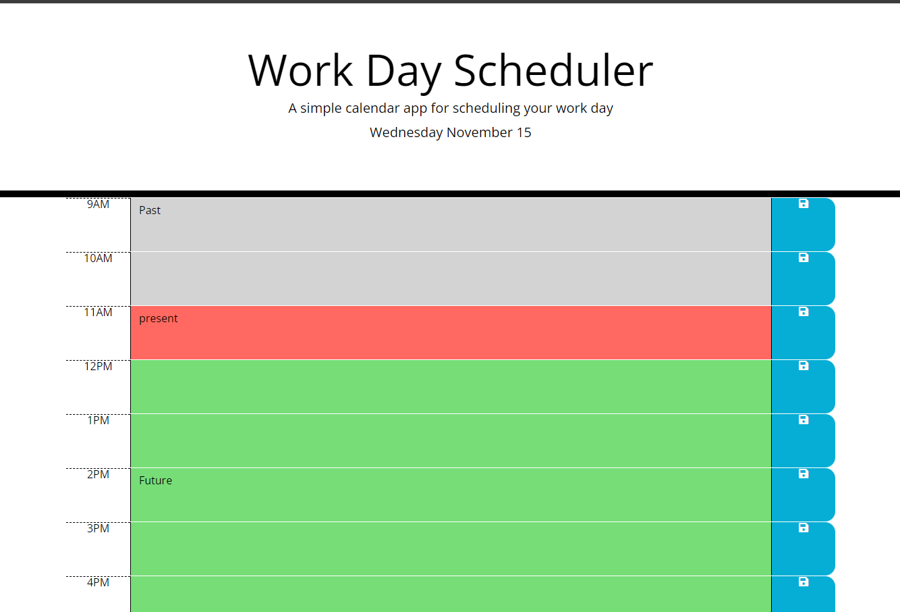
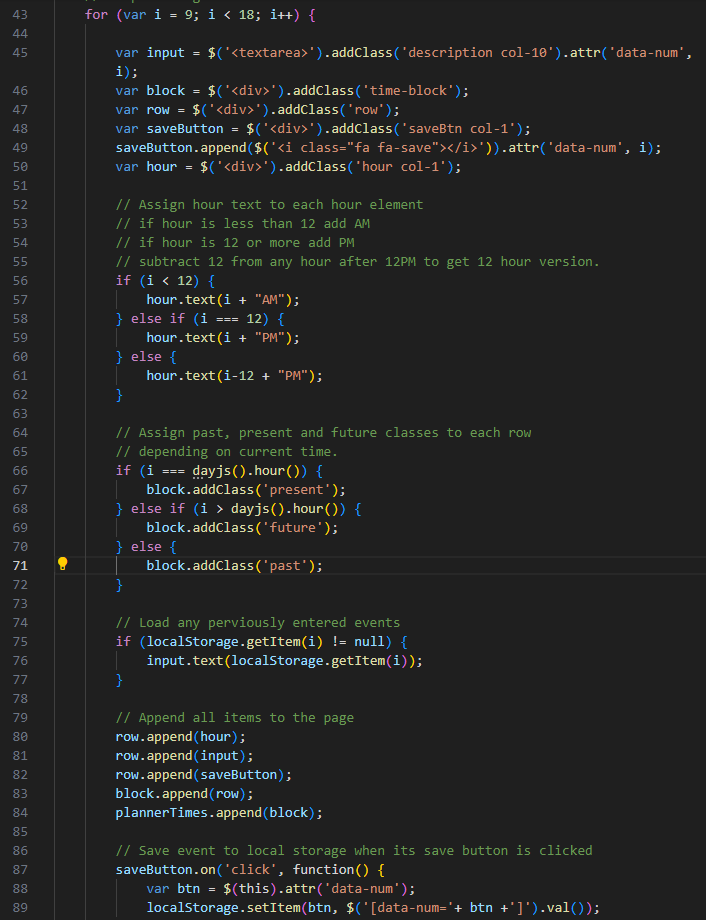

# Daily Planner Bootcamp Challenge

## Description

A daily planner built using the Days.js API. This is the seventh assignment in the Front-end Skills Bootcamp. For this assignment, we have been tasked with completing the functionality of a workday scheduler.

This application uses the Day.js API to retrieve information about the current date and time. 

Firstly, I used the Day.js API to grab and display the current day, month and day number at the top of the page. A quick look through the API's documentation told me how to retrieve and format this information.

The second stage of this assignment was to generate the planner itself. I started by writing a for loop to loop through the common work hours in a day (9am-5pm); the loop would then create all the relevant elements for a row in the planner and repeat this process for each hour in the workday. I was sure to add the appropriate classes to each element so that they were styles properly, according to the demonstration.

The user has the ability to click any of the fields in the planner and add an event. The user can then click the save button and the event will be saved into local storage, so that the next time you open the page, the even will load into the page also.

Below are a couple of images which show the code and functionality of the web application.

This task taught me how to ustilize third-party APIs in my projects and how to effectively use local storage.

## Installation

N/A

## Usage

The Work Day Scheduler can be found at this link: https://satsumasegment.github.io/daily-planner-bootcamp-challenge/

Use the text fields to enter information and the save buttons to save the information to local storage.